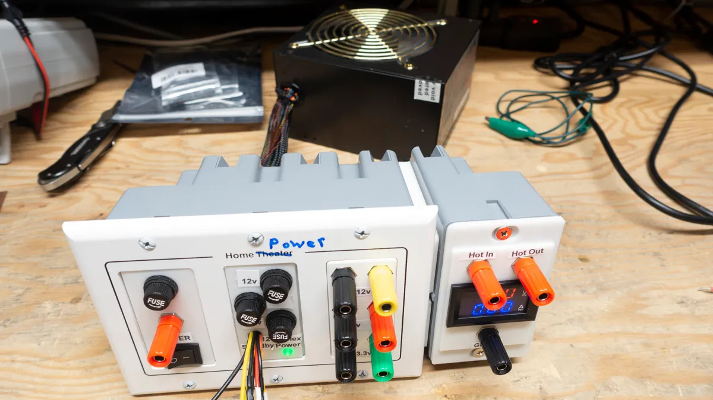
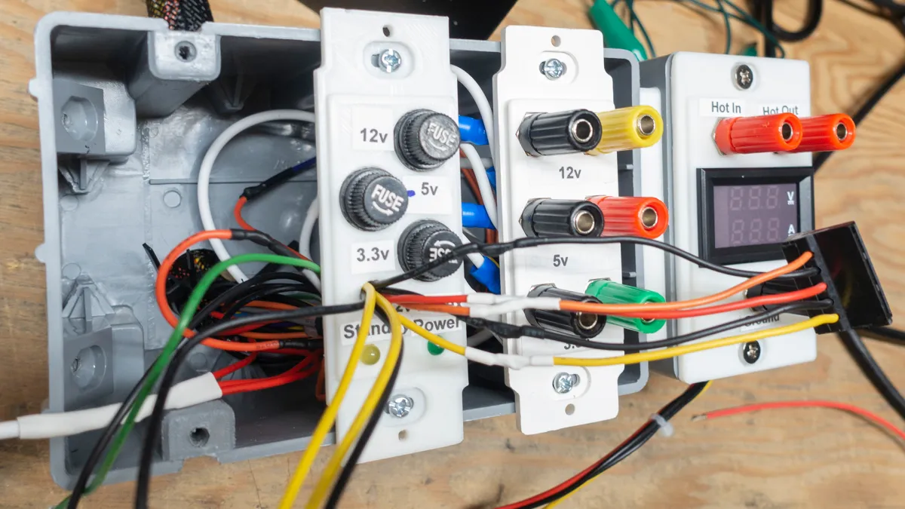
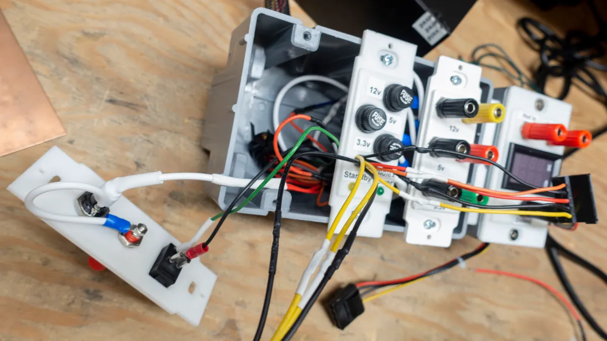
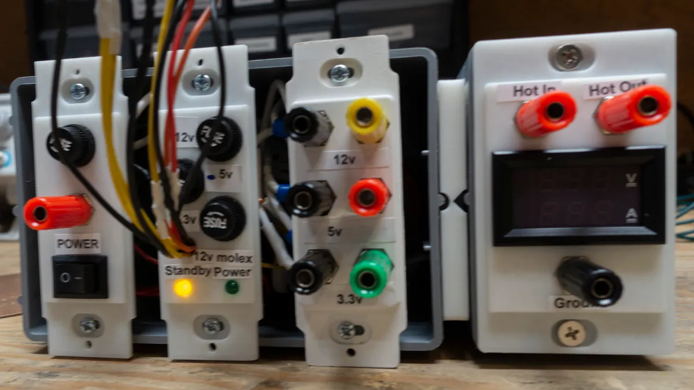
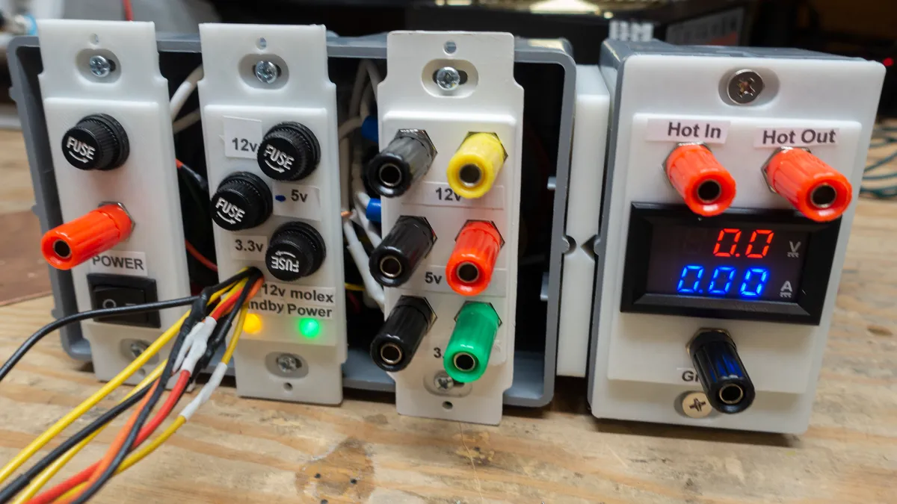
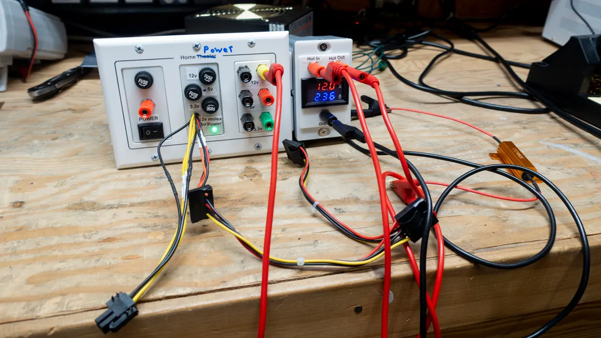
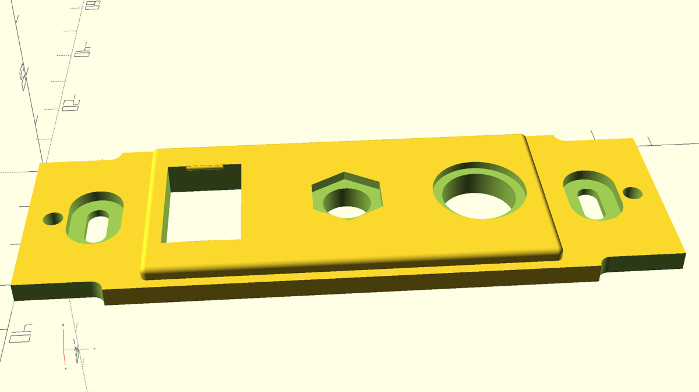
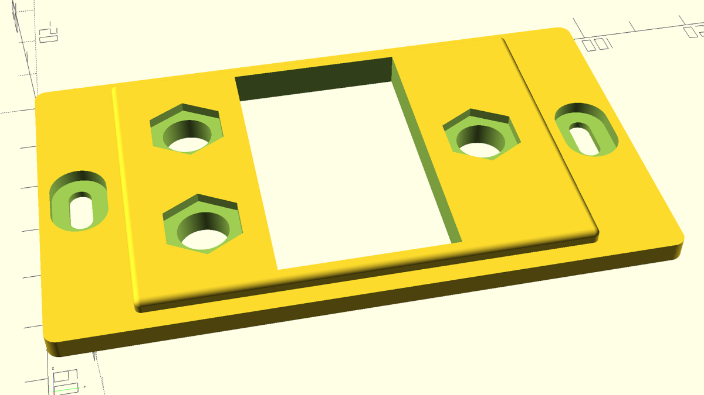
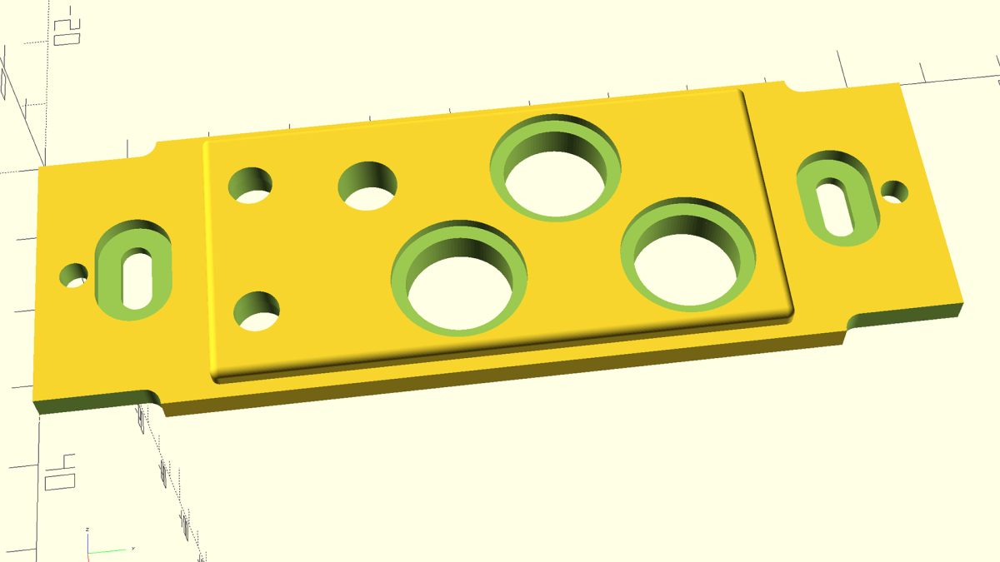

# Bench Power Supply from PC Supply
Use an old PC power supply to make a bench power supply

While waiting for parts for another project, I saw [this project](https://dronebotworkshop.com/atx-bench-supply/) on the DroneBot Workshop YouTube channel. I remembered that I had an old PC supply and figured I would give it a try.

I wanted to skip the woodworking that was in the source article and thought that just getting a multi-gang outlet box would be good. I don’t know if it was any better as the wood solution ended up with everything mounted together and I ended up with the PC supply separate from the rest and two outlet boxes glued up together. Also, I was probably too ambitious with the number and type of connectors. I ended up with 2x 5V connectors, a 12V, a 3.3V and fuses for all of them. Then I kept some PC disk connectors and a four pin molex that will probably never get used and crowded the wiring. Then I put in the power switch, LED status lights and volt/amp meter listed as optional from the article. Since you can find everything on the DroneBot Workshop article, I will skip the wiring here and just show some build pictures:

## 3D Printing Outlet/Switch Faces
This worked really well as you could design a base plate and then difference out all the features that you wanted for that plate. Also, the way these are designed with slot for the screw to hold it in allows for a little play and fewer reprints due to that tolerance. OpenSCAD files are in the repo, but here are some pictures:

## Things Learned
The cheap banana plug kit that I got was all stainless, so I could not solder to it. The connectors needed (small loops) then crowded the wiring inside the boxes as did my choice to probably include too many connectors. Add to that the large gauge wires needed to handle the number of amps from a PC supply and it turned out to be a giant pain to get everything in there.

Assembling your own banana plugs from a cheap, stainless kit that you can’t solder to is also a huge pain.

The reviews of the inexpensive volt/amp meter indicated that it was not very accurate on the amps side. I can confirm that for this one as it was consistently on one side of the range (I can’t remember if it was high or low, but can say it is best to do your project write-up during your project instead of a few months later.)

Buying a special home theater 3-gang face-plate with banana plug slots turned out to be mostly unusable and too expensive. I only reused one plate and none of the type of banana plugs that came with it. I should have just been less ambitious with the connectors and went with one three gang box and 3D printed one solid face (like the one on the right with the meter.) That would have also resolved the slight cover overlap with the box.
